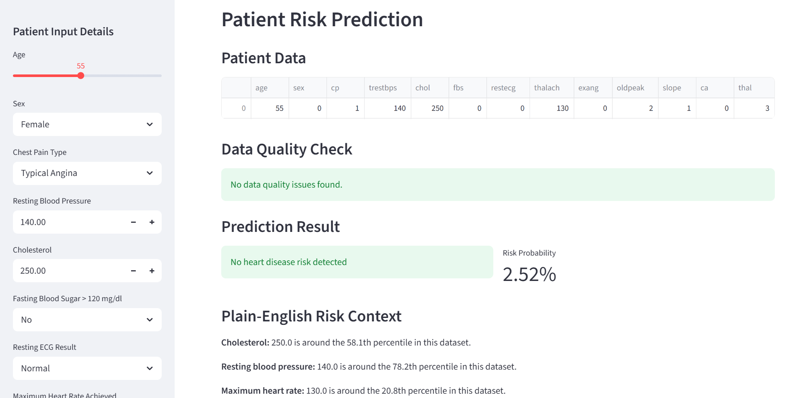
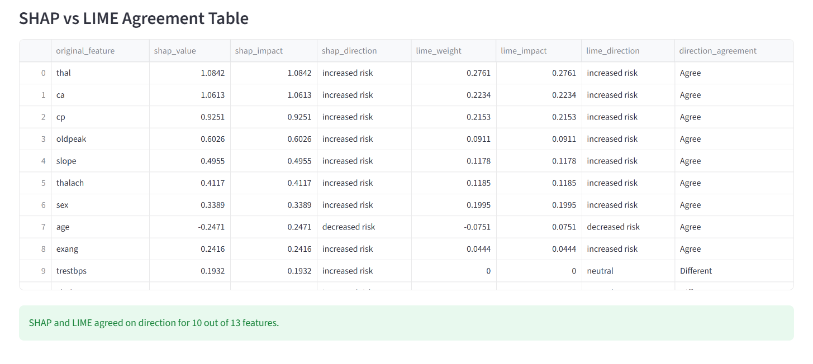
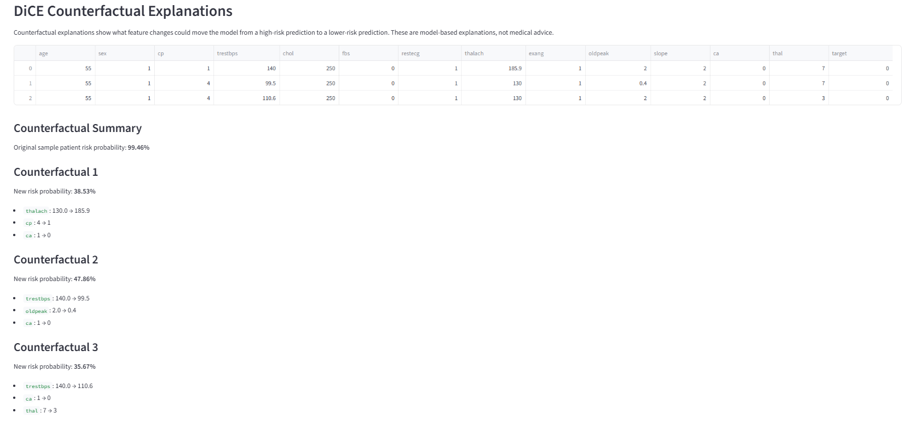

# Heart Disease Risk Predictor with XAI

An explainable machine learning web app that predicts heart disease risk and explains the prediction using SHAP, LIME, PDP, and DiCE.

This project is not just a basic predictor. It focuses on **data quality, model comparison, recall-focused evaluation, and explainable AI**.

```text
Patient Input → Data Validation → Risk Prediction → XAI Explanation
```

---

## Key Highlights

- Built using the UCI Heart Disease Cleveland dataset
- Handles missing values and imperfect input data
- Performs data quality and edge case validation
- Compares Logistic Regression, Random Forest, and XGBoost
- Selects best model based on recall, important for medical-risk prediction
- Uses SHAP, LIME, PDP, and DiCE for explainability
- Includes an interactive Streamlit web app

---

## Dataset

Dataset: **UCI Heart Disease Cleveland Dataset**

```text
Rows: 303
Features: 13
Target: 0 = No heart disease, 1 = Heart disease present
```

The original target values were converted into binary classification:

```text
0 → No heart disease
1, 2, 3, 4 → Heart disease present
```

Missing values were found in `ca` and `thal` and handled using imputation.

---

## ML Pipeline

A Scikit-learn pipeline was used for consistent preprocessing and prediction.

```text
ColumnTransformer
→ SimpleImputer
→ StandardScaler / OneHotEncoder
→ Classifier
```

Preprocessing:

```text
Numerical features   → Median imputation + scaling
Categorical features → Most frequent imputation + one-hot encoding
```

---

## Model Comparison

Three models were trained and compared.

| Model | Accuracy | Precision | Recall | F1-score | ROC-AUC |
|---|---:|---:|---:|---:|---:|
| XGBoost | 90.16% | 84.38% | **96.43%** | 90.00% | 95.67% |
| Logistic Regression | 86.89% | 81.25% | 92.86% | 86.67% | 96.65% |
| Random Forest | 88.52% | 83.87% | 92.86% | 88.14% | 94.43% |

**Best Model:** XGBoost  
**Reason:** Highest recall for the heart disease class.

For medical-risk prediction, recall matters because missing a high-risk patient can be more serious than giving an extra warning.

---

## Explainable AI

This project uses multiple XAI methods to make predictions more transparent.

| Method | Purpose |
|---|---|
| SHAP | Explains global and local feature impact |
| LIME | Explains a single prediction locally |
| SHAP vs LIME | Compares agreement between two explanation methods |
| PDP | Shows how feature values affect predicted risk |
| DiCE | Generates counterfactual explanations |

The goal is to avoid black-box prediction and make the model output easier to understand.

---

## Streamlit App

The app includes:

```text
Prediction
Model Comparison
SHAP
LIME vs SHAP
PDP
Counterfactuals
```

Users can enter patient details, view risk probability, check data quality warnings, and explore model explanations interactively.

---

## Screenshots

### Prediction and Risk Score



### Explainability Dashboard



### Counterfactual Explanations



---

## Project Structure

```text
Heart-Disease-Predictor-XAI/
├── data/
├── models/
├── notebooks/
├── plots/
├── reports/
├── screenshots/
├── app.py
├── load_dataset.py
├── requirements.txt
├── README.md
└── .gitignore
```

---

## Quick Start

Install dependencies:

```bash
python -m venv .venv
.venv\Scripts\activate
pip install -r requirements.txt
```

Run the app:

```bash
streamlit run app.py
```

To reproduce training and XAI outputs:

```bash
python load_dataset.py
python notebooks/compare_models.py
python notebooks/shap_global_local.py
python notebooks/lime_explain.py
python notebooks/pdp_analysis.py
python notebooks/dice_counterfactual.py
```

---

## Limitations

- Dataset is small with 303 records
- Model is not clinically validated
- Explanations describe model behavior, not medical truth
- Counterfactuals are model-based and should not be treated as treatment advice

---

## Medical Disclaimer

This application is for educational and research purposes only.

It is not intended to diagnose, treat, cure, or prevent any disease.

---

## Author
V Harichandana
